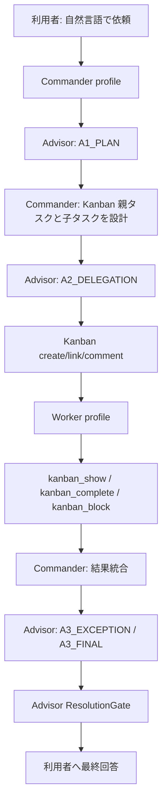

# ExecPlan: Kanban-Centered Hermes Runtime

## 目的

この文書は、Hermes Runtime を Kanban 中心の構成へ移行するための実行計画を定義する。

利用者は自然言語で依頼するだけにする。Commander が依頼を解釈し、計画し、Kanban に作業を登録する。Worker は Kanban に割り当てられた作業だけを実行する。Advisor は実行せず、計画、割当、例外、最終回答を監査する。

初期版では `delegate_task` を使わない。単発作業も Kanban タスクとして扱い、作業、証跡、監査結果の正本を Kanban に寄せる。

## 基本方針

| 項目 | 方針 |
|---|---|
| 作業単位 | すべて Kanban タスクにする |
| 正本 | Hermes Kanban のタスク、コメント、イベント、完了要約、完了時メタ情報 |
| Commander | 専用 Hermes プロフィールとして定義する |
| Worker | Kanban に割り当てられたタスクだけを実行する |
| Advisor | Review-only を維持し、直接実行しない |
| 本体改修 | 行わない。公式のプロフィール、ツールセット、Skill、Plugin、Hook を使う |
| 初期除外 | `delegate_task`、独自キュー、実行時差し替え、Hermes Core 直接変更 |
| 実行証跡 | 公式CLI、Kanban、Advisorレシート、Skill、Plugin Hook、リポジトリチェックに限定する |

## 確認済み前提

Pi 上の Hermes 実環境で、次の最小確認は完了している。

| 確認 | 結果 |
|---|---|
| Commander プロフィール作成 | 成功。`commander` を公式 CLI で作成 |
| Commander への Kanban ツールセット付与 | 成功。`toolsets = [kanban, advisor_gate, skills]` を設定 |
| Commander からの `kanban_create` | 成功。検証タスク `t_8e8f6757` を作成 |
| Kanban 証跡保存 | 成功。`advisor-precheck` テナントに保存 |
| Worker への割当 | 成功。検証タスク `t_64b7d292` を `default` に割当 |
| Dispatcher による Worker 起動 | 成功。`hermes kanban dispatch --max 1` で起動 |
| Worker の `kanban_show` と `kanban_complete` | 成功。`t_64b7d292` は `done` |
| 完了要約とメタ情報 | 成功。変更ファイルなし、検証情報、Worker session id が記録された |

重要な確認事項:

- `-t kanban` を指定するだけでは Commander からの作成前提として不十分だった。
- Commander プロフィールの設定に `toolsets` として `kanban` が必要だった。
- Dispatcher 起動後、Worker 完了は非同期に進むため、スモーク手順には状態確認の待機が必要である。

## 目標構成

## Kanban 上の記録方針

| 情報 | Kanban 上の置き場所 | 理由 |
|---|---|---|
| 利用者依頼 | 親タスク本文 | 作業全体の起点にする |
| Commander の計画 | 親タスク本文またはコメント | 後から意図を追えるようにする |
| A1 監査結果 | 親タスクコメント | 計画承認または差し戻しの履歴として残す |
| 子タスク割当案 | 親タスクコメント、子タスク本文 | Worker が前提を読めるようにする |
| A2 監査結果 | 親タスクコメント | 分解と割当の監査履歴として残す |
| Worker 成果 | `kanban_complete(summary, metadata)` | 公式の構造化引き継ぎを使う |
| Worker ブロック | `kanban_block(reason)` | 人間判断または再計画の対象にする |
| A3 監査結果 | 統合タスクまたは親タスクコメント | 最終回答の根拠にする |
| 最終回答 | 親タスク完了要約、または統合タスク完了要約 | 会話外からも追えるようにする |

Advisor 自身は Kanban を直接更新しない。Advisor は構造化された監査結果を返し、Commander が必要な内容を `kanban_comment` または `kanban_complete` の要約とメタ情報として残す。

## Advisor NG 時の再作業ループ

Advisor の `CHANGES_REQUIRED` または `BLOCK` は、Kanban タスクが自動的に成功まで回り続けることを意味しない。公式 Kanban では、Worker は割り当てられたタスクを `kanban_complete` または `kanban_block` で一度確定する。差し戻し、再実行、追加調査は Commander が Kanban 上で明示的に管理する。

| Advisor 結果 | Commander の扱い | Kanban 上の処理 |
|---|---|---|
| `PASS` | 次の段階へ進める | 監査要約をコメントし、必要なら子タスクを登録または最終統合へ進む |
| `CHANGES_REQUIRED` | 指摘を受理し、作業を再設計する | 親タスクに指摘をコメントし、同じ作業を再オープンするか、修正用の追加タスクを作る |
| `BLOCK` | 人間判断、秘密、外部条件などを待つ | 親タスクまたは対象タスクを `kanban_block` し、解除条件をコメントする |

再作業の原則:

- Advisor の指摘は必ず親タスクのコメントに残す。
- 修正が実作業を伴う場合は、追加 Kanban タスクとして作る。
- 元の Worker 成果を上書きしない。完了済みタスクは証跡として残す。
- 再実行が必要な場合は、Commander が再オープンまたは新規タスクで明示する。
- A3 で NG になった場合、Commander は最終回答せず、指摘解消用タスクを作るか、未解決としてブロックする。

このため、`delegate_task` のような親会話内の暗黙的な再依頼ループは初期版では使わない。Kanban では、再作業もタスク、コメント、イベントとして残す。

## 実装段階

### Phase 1: Runtime Profile を Kanban 前提へ更新

目的:

- `commander` を公式プロフィールとして扱う前提を文書化する。
- 初期構成で `delegate_task` を使わないことを明示する。
- Kanban タスクを全作業の正本にする。

作業:

- `runtime-profile/config/hermes.config.example.yaml` に Commander 用の設定例を追加する。
- `runtime-profile/locks/hermes-version.lock` の対象バージョンと検証日を更新する。
- `runtime-profile/runbooks/install-pi.md` に Commander プロフィール作成と `toolsets` 設定を追加する。
- `runtime-profile/runbooks/live-smoke.md` を Kanban-only smoke に更新する。

完了条件:

- Commander プロフィール作成手順が手順書だけで再現できる。
- `delegate_task` を使う前提が初期 smoke から消える。

### Phase 2: Skill 定義を Kanban 役割へ更新

目的:

- Commander、Worker、Advisor Flow の責務を Kanban 前提に合わせる。

作業:

- `runtime-profile/skills/commander/SKILL.md` を更新し、Commander は作業実行せず、Kanban 作成、依存付け、コメント、統合に集中することを明記する。
- `runtime-profile/skills/worker/SKILL.md` を更新し、Worker は割り当てられた Kanban タスクを `kanban_show` で読み、`kanban_complete` または `kanban_block` で終えることを明記する。
- `runtime-profile/skills/advisor-flow/SKILL.md` を更新し、Advisor 結果を Kanban コメントまたは完了メタ情報に残す運用を明記する。

完了条件:

- 利用者が Worker 数や作業分解を指定する前提がなくなる。
- Commander が自然言語から Kanban 登録まで担当することが明確になる。

### Phase 3: Advisor Gate の A2 を Kanban 割当監査へ寄せる

目的:

- `A2_DELEGATION` を `delegate_task` 前提から Kanban タスク割当監査へ移す。

作業:

- A2 packet に Kanban 親タスク、子タスク案、担当プロフィール、依存関係、期待証跡を含める。
- `worker_assignments` を Kanban タスク割当として解釈できるように文書と検証を更新する。
- `pre_tool_gate` の A2 説明文から `delegate_task` 固有表現を外す。
- `kanban_create`、`kanban_link`、`kanban_comment` の前に A1/A2 が必要になる設定例を追加する。

完了条件:

- A2 が Kanban task graph の妥当性を監査できる。
- `delegate_task` を使わない smoke で A1、A2、A3 が通る。

### Phase 4: Kanban 証跡化を標準運用にする

目的:

- Advisor 結果と Commander 判断が Kanban 上に残るようにする。

作業:

- Advisor 結果を Commander が `kanban_comment` として残すためのコメントひな形を追加する。
- `PASS` は短い監査要約としてコメントに残す。
- `CHANGES_REQUIRED` と `BLOCK` はコメントに残し、実作業が必要な場合だけ追加 Kanban タスクを作る。
- 完了時 `metadata` に最低限の証跡項目を入れる運用を定義する。

完了条件:

- Kanban の `show` だけで、計画、監査、実行結果、未解決事項を追える。
- Advisor の別記録だけに依存しない。

### Phase 5: Kanban-only Live Smoke を作る

目的:

- 利用者が自然言語で依頼するだけの通し検証を作る。

作業:

- Commander チャットから親タスクを作る。
- Commander が A1 を通す。
- Commander が子タスク案を作り、A2 を通す。
- Commander が `kanban_create` と `kanban_link` を実行する。
- Dispatcher が Worker を起動する。
- Worker が `kanban_show` して `kanban_complete` する。
- Commander が結果を統合し、A3 と ResolutionGate を通す。
- 最終回答を返す。
- 最終回答は、直近の `A3_FINAL` で監査された
  `final_answer_draft` と完全一致させる。

完了条件:

- Pi 上で証跡付き smoke が再現できる。
- 証跡は Kanban タスク ID、セッション ID、完了要約、メタ情報で追える。
- Plugin/Core 内部モジュールの直接 import による私的シミュレーションを
  live smoke の代替証跡にしない。

### Phase 6: テストと回帰確認

目的:

- 既存の plugin tests を壊さず、Kanban 前提の新しい検証を追加する。

作業:

- 既存の `tests/test_end_to_end_flow.py` を残しつつ、Kanban packet の単体テストを追加する。
- A2 の必須項目不足を検出するテストを更新する。
- `mise run check` をローカルと Pi で実行する。

完了条件:

- ローカルで `mise run check` が通る。
- Pi で `mise run check` が通る。
- Pi で Kanban-only smoke が通る。

## 受け入れ基準

| 基準 | 判定条件 |
|---|---|
| 公式準拠 | Hermes Core を変更せず、公式のプロフィール、Kanban、Skill、Plugin、Hook だけを使う |
| Kanban-only | 初期フローで `delegate_task` に依存しない |
| 自然言語入口 | 利用者に Worker 数や A1/A2/A3 の実行を要求しない |
| Commander 責務 | Commander が計画、Kanban 登録、統合を担い、実作業をしない |
| Worker 責務 | Worker が割当タスクだけを実行し、Kanban に完了またはブロックを残す |
| Advisor 責務 | Advisor が実行せず、監査結果だけを返す |
| 証跡 | Kanban 上で計画、監査、作業結果、未解決事項を追える |
| 再現性 | Pi 上で手順書どおりに smoke を再実行できる |
| 最終回答の鮮度 | 直近の `A3_FINAL` が監査した `final_answer_draft` と実際の最終回答が一致する |

## 残リスク

| リスク | 影響 | 対応 |
|---|---|---|
| Commander が作業を直接実行する | 役割が混ざり、監査対象が曖昧になる | Commander profile の toolsets を Kanban、Advisor、Skills 中心に制限する |
| Advisor 結果が Kanban に残らない | Kanban だけで経緯を追えない | Commander SKILL と smoke で `kanban_comment` を必須化する |
| 内蔵自動分解と Commander 判断が混ざる | 設計意図と実行結果がずれる | 初期版では Commander が明示的に作る。自動分解は別途検討にする |
| Worker 完了が非同期で遅い | smoke が不安定に見える | 状態確認と待機を手順化する |
| `created_by` が期待した名前と異なる | 証跡の読み取りで混乱する | session id、profile、task id、コメントを合わせて判断する |

## 実施しないこと

- Hermes Core の直接変更。
- 実行時差し替え。
- `delegate_task` を初期フローに戻すこと。
- Advisor に実装作業や Kanban 更新を直接させること。
- 利用者に Kanban カードを手で分解させること。

## 参照

- Hermes Kanban official documentation: https://hermes-agent.nousresearch.com/docs/user-guide/features/kanban
- Hermes Skills official documentation: https://hermes-agent.nousresearch.com/docs/user-guide/features/skills
- Hermes source: `tools/kanban_tools.py`
- Hermes source: `agent/prompt_builder.py`
- Pi verification tenant: `advisor-precheck`
- Pi verification tasks: `t_8e8f6757`, `t_64b7d292`
